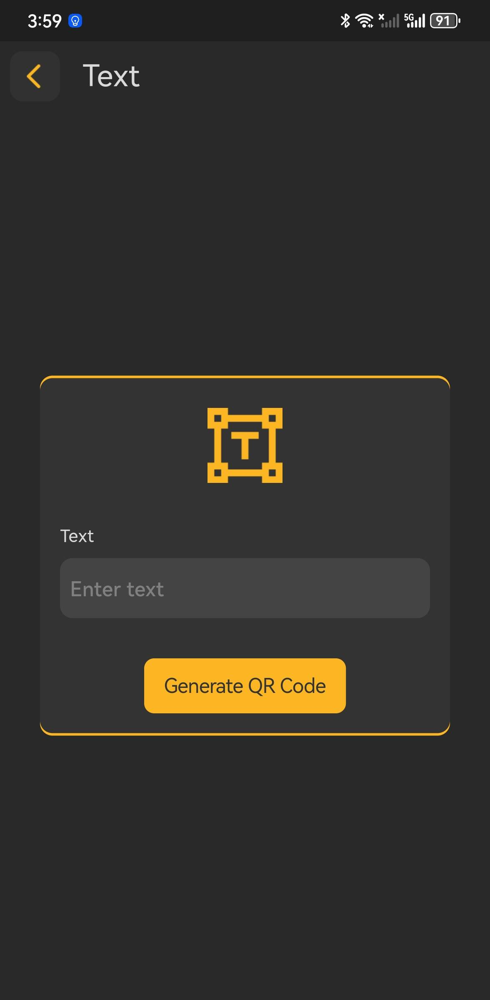
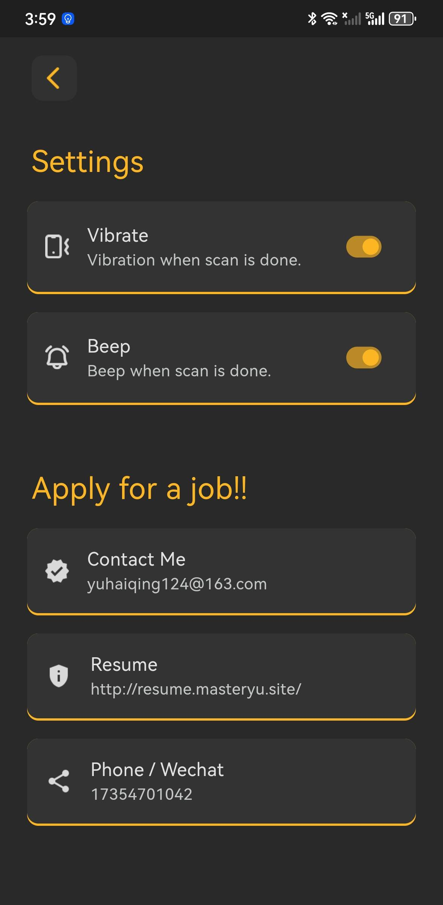
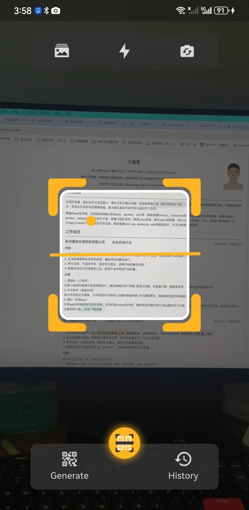

# 二维码工具app

没广告，没广告，没广告，最烦广告了

一个扫描二维码的工具app

用flutter语言完成，目前仅支持android apk打包。

## 希望大家能给个星星✨✨✨

解析二维码内容，生成二维码，小工具

ui使用的是 figma 上面一个开源的ui
平时开发项目的时候，需要手机扫码查看二维码内容的时候，免费的都是要看广告的，自己搞一个

唉嘿嘿！其实也不是完全自己写的，就是画了一个ui，用了别人的开源插件 mobile_scanner 

怎么自己写一个二维码识别呢，是不是得看webgl opengl之类的 

## 预备增加的功能

1. 震动
2. 提示
3. 不跳转详情， 一直扫描 存储
4. 自动复制扫描结果